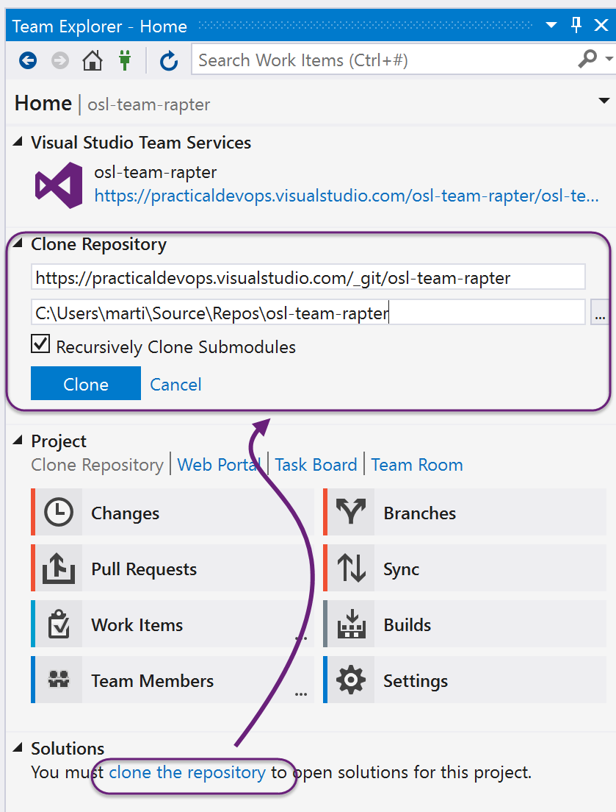
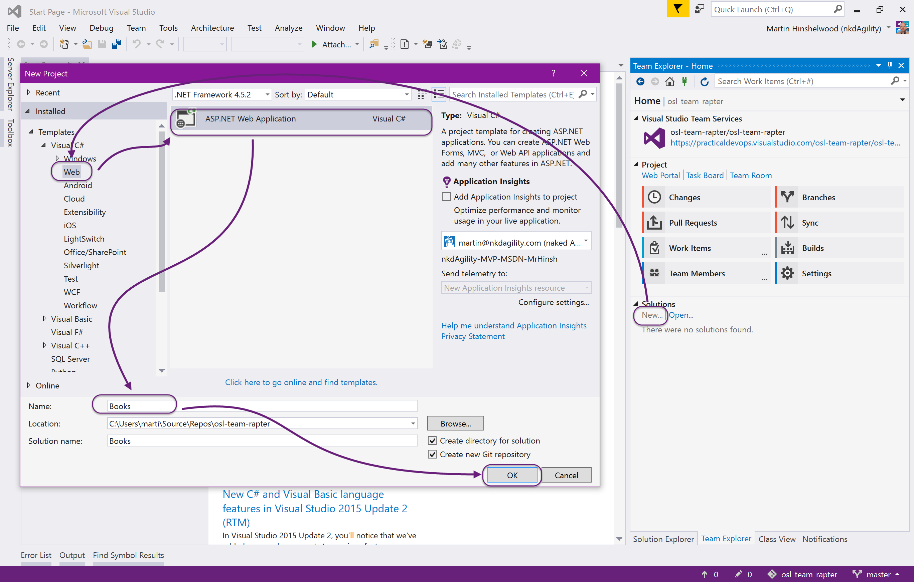
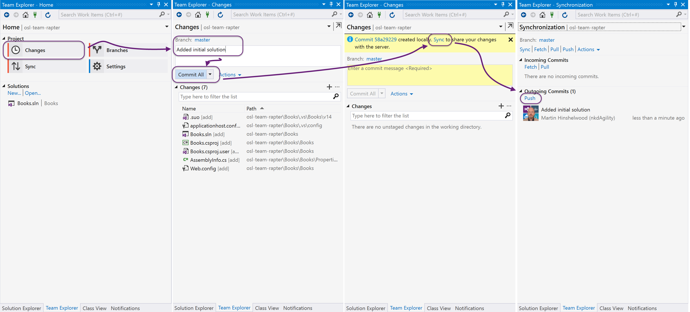

# Exercise 1


## Learnings

1. Adding your code to source control
2. How to create a RESTful Web API project with OWIN from scratch
3. Understand the importance of NuGet (will become even more important with .NET Core)
4. Learn very basics about ASP.NET Web API development (this will not be a deep dive as we focus on DevOps, not just Dev) 


## Creating Project in Visual Studio

1. Start Visual Studio

1. Connect to http://practicaldevops.visualstudio.com in Team Explorer and select the Team Project of the name [location]-team-[yourTeamName].<br/>

1. Clone the repository to your local disk<br />

1. Create a new web project. **Disable** Application Insights for now. We will add Application Insights later. <br/>

1. Use the **ASP.NET 4.5.2 "Empty" Template**:<br/>
   

1. Switch to latest version of .NET:<br/>
   

1. **Discussion points:**
   * Evolution of .NET (3.x, 4.x, Core)
   * Motivation of Microsoft to not just continue the way of the past with .NET (importance of cross-platform, modern architecture, open-source, etc.)
   * Describe that we now focus on the production version of .NET (4.6), ASP.NET Core Preview follows later.
   
1. Install necessary NuGet packages by running the following commands in Visual Studio's *Package Manager Console* (you can use *Manage NuGet Packages for Solution* instead if you prefer GUI over PowerShell):
   * `Install-Package Microsoft.AspNet.WebApi.Owin`
   * `Install-Package Microsoft.Owin.Host.SystemWeb`
   * `Install-Package Microsoft.Owin.Cors`
   * `Install-Package Microsoft.ApplicationInsights.Web`
   * `Install-Package WindowsAzure.Storage`

1. **Discussion points:**
   * NuGet as a delivery mechanism for .NET components
   * Growing importance of NuGet for Microsoft-oriented development teams
   * nuget.org vs. private feeds in the cloud (e.g. myget) vs. private feeds on-premise

1. Add an OWIN Startup Class:<br/>
   

1. Replace the `Configuration` method with the following sample code.
   ```
    public void Configuration(IAppBuilder app)
    {
        app.Run(context => context.Response.WriteAsync("Hello World!"));
    }
   ```

1. **Discussion points:**
   * Describe OWIN architecture
   * Describe OWIN's pipeline concept
   * Difference to "old" ASP.NET web apps
   * Note that a practical use of OWIN (self-host web server in automated test) will follow later

1. Run the program and see if the browser shows `Hello World` for all paths.


## Add Service Implementation

1. Open *Add References*:<br/>
   

1. Add references to the following framework assemblies:
   * `System.ComponentModel.Composition`
   * `System.ComponentModel.Composition.Registration`
   * `System.Reflection.Context`

1. Copy `.cs` files from [Excercise-1-Service-Implementation](Assets/Exercise-1-Service-Implementation) into your project. Note that you can overwrite `Startup.cs`.

1. **Discussion points:**
   * Code walkthrough (depth depends on existing knowledge and interests of the audience)
   * Describe the [use of MEF](../Sample/Books/Startup.cs#L42-L62) for dependency injection ([`INameGenerator`](../Sample/Books/Services/INameGenerator.cs), [`BooksDemoDataOptions`](../Sample/Books/Controllers/BooksDemoDataOptions.cs))
   * Point out that this will work entirely different in ASP.NET Core 1.0

1. Add the following `appSettings` to your `web.config` file. These settings control how many random books are generated by the Web API.
   ```
    <?xml version="1.0" encoding="utf-8"?>
    ...
    <configuration>
        <appSettings>
            <add key="MinimumNumberOfBooks" value="1"/>
            <add key="MaximumNumberOfBooks" value="5"/>
        </appSettings>
        ...
    </configuration>
   ```

1. **Discussion points:**
   * Describe the problem of stage-related settings (e.g. different configuration options for dev/test/prod)
   * Point out the importance of correct handling of security-critical settings (e.g. checked-in connection strings as an anti-pattern)

1. Build your solution. There should be no errors.

1. Run your program and try the URL `http://localhost:2690/api/books` (this assumes that your app runs on port 2690; you have to replace this port with the port that your Visual Studio has chosen).

1. Refresh the URL mentioned above multiple times. Note how random books with random names are generated.

1. Push the new web project to your Git repository in TFVC<br />
   

1. **Discussion points:**
   * (Option if you have some Devs in the audience) Debug the application to give attendees a deeper insight into the structure of the application

1. *Postman* is a very handy tool for testing Web APIs. You can get it here: [Postman on Chrome Web Store](https://chrome.google.com/webstore/detail/postman/fhbjgbiflinjbdggehcddcbncdddomop). Install *Postman* and try the Web API.<br/>
   
   
   
## Further Ideas

If you have time left, you could additionally cover topics like:

* Building a console app that hosts our Web API without IIS
* Add additional middleware components (e.g. CORS, authentication) to demonstrate modular architecture with NuGet
* (Not recommended but possible if you have a very web-development-oriented audience) Add the Angular 2 client ([source](../Sample/AspNetCore1/src), [Gulpfile](../Sample/AspNetCore1/Gulpfile.js), `.json` config files) to the project
